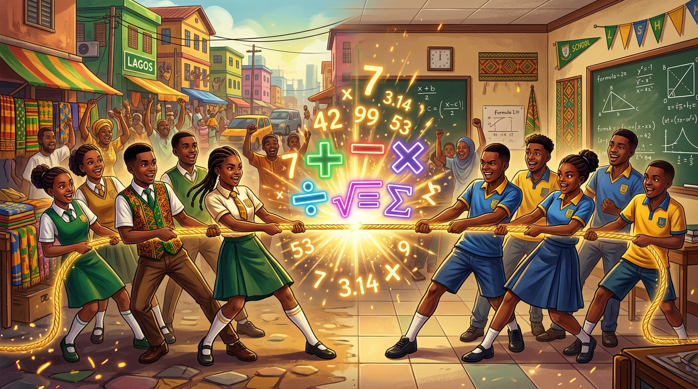

# 🇳🇬 Naija Math Battle

> **Who sabi math pass? Prove am! ⚡**  
> Nigeria's ultimate multiplayer math tug-of-war battle game, built with Vanilla HTML5/CSS3/JavaScript and Firebase.



---

## 🌟 Overview

**Naija Math Battle** is a cultural edutainment multiplayer game where two players compete in rapid-fire mathematics to pull a tug-of-war rope to their side. Every correct answer pulls the rope closer to victory!

Built from the ground up for Nigerian students and gamers of all ages, it blends pure arithmetic drills with authentic Nigerian street and market-flavored story problems.

---

## 🚀 Key Features

### 1. 🎮 Three Multiplayer Modes
- **Local Battle (Same Device)**: Split-screen Pass 'n' Play on a tablet, phone, or laptop with dual keypads and customizable team avatars.
- **Online Battle (Room Code)**: Create a room and share a 6-character room code (e.g. `NAI-8K2Q9P`) with any opponent on any device.
- **Challenge Friend (By Username)**: Search any player by their unique username and send an instant real-time battle invitation!

### 2. 🔀 Shuffled Questions & Game Variations
- **Pure Arithmetic**: Addition, subtraction, multiplication, and division calibrated across **Easy**, **Medium**, and **Hard** tiers.
- **Naija Stories**: Word problems featuring Naira (₦), Danfo conductors, Keke Napep fares, puff-puff, meat pies, suya, Agege bread, kolo savings, and famous markets (Balogun, Mile 12, Onitsha Main Market, Bodija, Wuse).
- **Mixed (Shuffled)**: Deterministically shuffles question types each round so both players face the exact same question simultaneously without any network lag!
- **Balanced Operation Cycles**: Ensures even and non-repetitive distribution of operations across rounds.

### 3. 🥋 6 Selectable Nigerian Characters
| Character | Specialty / Style | Color Theme |
|---|---|---|
| **Tunde** | School Uniform Math Prodigy | Royal Blue (`#1565c0`) |
| **Amaka** | Quick-Calculations Champion | Bold Pink (`#e91e63`) |
| **Emeka** | Speed & Strategy Master | Energetic Orange (`#f57c00`) |
| **Fatima** | Northern Regional Star | Vibrant Magenta (`#e91e8e`) |
| **Chike** | Traditional Agbada Boss | Forest Green (`#2e7d32`) |
| **Sade** | Elegant Iro & Buba Tactician | Royal Purple (`#7b1fa2`) |

### 4. ⚡ Real-Time Physics & Dual Keypads
- Responsive tug-of-war rope marker moving smoothly across 10 pull intervals (`-5` to `+5`).
- On-screen touch-friendly numerical keypads designed for mobile, tablet, and desktop play.
- Live countdown timers (10s–15s per round) with urgent timer animations.
- Winner celebrations featuring dynamic canvas confetti.

### 5. 🏆 Accounts, Profiles & Global Leaderboard
- Secure Firebase Authentication (Email/Password registration & login).
- Real-time profile tracking: Wins, Losses, and Rating points (1000+).
- Live top 20 Leaderboard ranking Nigeria's top math champions.

---

## 🛠️ Tech Stack

- **Frontend**: Vanilla HTML5, CSS3 (Modern dark-mode design with Nigerian green & gold accents), ES6+ JavaScript.
- **Backend / Cloud**: Firebase Realtime Database (room synchronization & live game state), Cloud Firestore (user profiles & leaderboard), Firebase Auth (authentication).
- **No Heavy Frameworks**: Ultra-lightweight, zero build steps, runs directly in any browser or local server (XAMPP, Apache, Live Server).

---

## 📁 Project Structure

```
Game/
├── index.html            # Main Single-Page Application (12 screens)
├── README.md             # Project documentation
├── SETUP.md              # Firebase configuration guide
├── .gitignore            # Git ignore file
├── assets/
│   ├── hero.jpg          # Tug-of-war battle banner
│   └── characters/
│       ├── set_a.jpg     # Character sprites (Tunde, Amaka, Emeka)
│       └── set_b.jpg     # Character sprites (Fatima, Chike, Sade)
├── css/
│   └── style.css         # Complete UI design system & responsive styling
└── js/
    ├── config.js         # Firebase credentials configuration
    ├── questions.js      # Seeded RNG question generator & Naija story engine
    ├── app.js            # SPA navigation, state manager, leaderboard
    ├── auth.js           # Firebase Auth, user profiles & statistics
    ├── lobby.js          # Room generation, code joining, search & challenge
    └── game.js           # Local & online tug-of-war game loop & animations
```

---

## 🏁 Quick Start & Setup

### 1. Clone or Download
```bash
git clone https://github.com/smarttonna/Naija-Game.git
```

### 2. Run Locally
- **With XAMPP**: Place the `Game` folder in your `htdocs` directory and navigate to `http://localhost/Game/`.
- **With Python**:
  ```bash
  python3 -m http.server 8000
  ```
- **With VS Code**: Right-click `index.html` and select **Open with Live Server**.

### 3. Connect Firebase
1. Visit [Firebase Console](https://console.firebase.google.com/) and create a free project.
2. Enable **Email/Password** under Authentication.
3. Enable **Cloud Firestore** and **Realtime Database** in test mode.
4. Copy your web app config into `js/config.js`:
   ```javascript
   const firebaseConfig = {
     apiKey: "YOUR_API_KEY",
     authDomain: "YOUR_PROJECT_ID.firebaseapp.com",
     databaseURL: "https://YOUR_PROJECT_ID-default-rtdb.firebaseio.com",
     projectId: "YOUR_PROJECT_ID",
     storageBucket: "YOUR_PROJECT_ID.appspot.com",
     messagingSenderId: "YOUR_MESSAGING_SENDER_ID",
     appId: "YOUR_APP_ID"
   };
   ```
5. See `SETUP.md` for full step-by-step instructions.

---

## 📄 License
This project is open-source and free to use for educational purposes.
